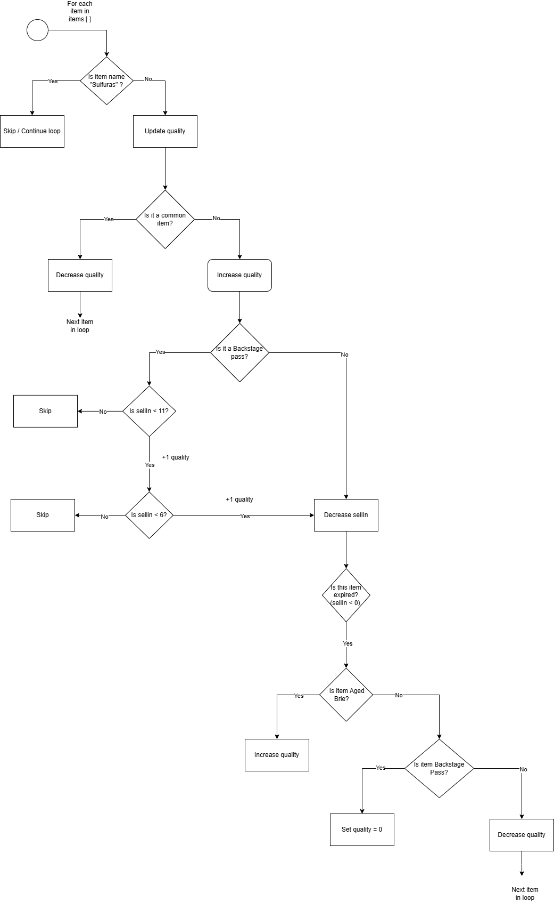

# Gilded Rose Post-Refactor Architecture

## Key Refactor Changes
- **Legendary Item Handling (Sulfuras)**:
  Early `continue` to skip updates and preserve quality/sellIn.

- **Method Extraction**:
  Extracted `adjustQuality()`, `increaseQuality()`, and `decreaseQuality()` for clarity and reuse.

- **Constants Introduced**:
  Item names (`SULFURAS`, `AGED_BRIE`, `BACKSTAGE_PASS`) replaced hardcoded strings.

## Processing Flow

1. **Legendary Items**
   → Skipped from updates (`Sulfuras` stays fixed)

2. **Quality Update**
    - *Normal items*: Decrease by 1 (never below 0)
    - *Aged Brie*: Increase by 1 (up to 50)
    - *Backstage passes*: Increase more as `sellIn` approaches 0

3. **SellIn Decrease**
   → All non-legendary items have `sellIn` decremented by 1

4. **Post-Expiry Handling**
    - *Normal items*: Degrade twice as fast
    - *Aged Brie*: Continues to improve
    - *Backstage passes*: Quality drops to 0 after concert

## Workflow Diagram

*Figure: Visual representation of the `updateQuality()` logic*
